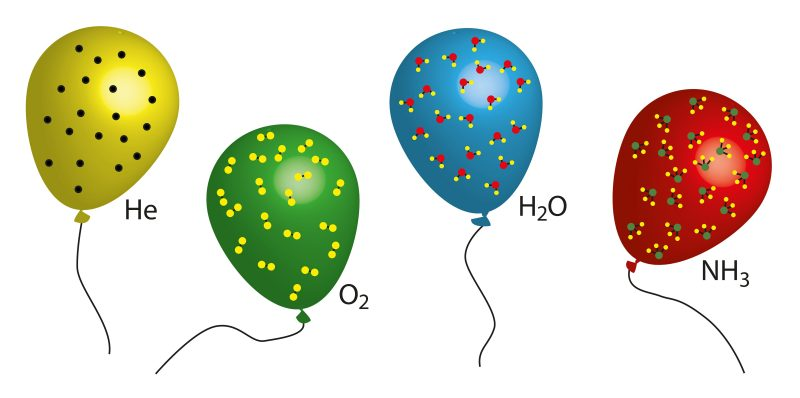

<!-- .slide: data-background-image="./assets/avogadro.png" data-background-opacity=".5" data-background-size="contain" -->
# Avogadro et la mole 

## Définition 

> La *mole* est une des unités de base du Système International. La mole est la quantité de matière d'un système contenant exactement $6,022\,140\,76 \,\times 10^{23}$ entités élémentaires (atomes, ions, molécules).

La mole est donc un paquet d'entités chimiques.

## Nombre ou constante

- Un nombre n'a pas d'unité, une constante en a une. <!-- .element: class="fragment" data-fragment-index="1" -->
- Le nombre d'Avogadro est la valeur numérique fixée de la constante d’Avogadro ; la constante d'Avogadro est : $$N_A = 6,022\,140\,76 \,\times 10^{23}\,mol^{−1}$$  <!-- .element: class="fragment" data-fragment-index="2" -->

## C'est grand comment ???

Pour donner un ordre de grandeur, le même nombre en grains de maïs permettrait de recouvrir la surface des États-Unis d'une couche uniforme d'une épaisseur d'environ $14,5\,km$.

## Interlude vidéo

## Intérêt de la mole

* La mole est une **unité de comptage**, comme la centaine ou la douzaine, mais ne sert qu’à compter les atomes ou les molécules.
* Elle a la particularité d’être immense (environ six cent mille milliards de milliards).

 

---

*Exemples :*
* une douzaine de pommes ou d'œufs : $12$ unités
* une mole de plomb ou de carbone :  $602\,214$ milliards de milliards d'atomes

> &Eacute;chelle macroscopique : très grands nombres d'atomes. Pour simplifier, on les regroupe par paquets appelés *moles*.

---

*Exemple : $6\,g$ d'aluminium, c'est :*
* environ $1,34\,\times 10^{23}$ atomes
* environ $0,22\,mol$ d'atomes

## Autre intérêt

* La mole permet de relier le monde macroscopique au monde de l'infiniment petit. 
* La masse d'une mole d'atomes, lorsqu'elle est exprimée en grammes, correspond à peu près au nombre de nucléons de cet atome.

---

*Exemple : l'aluminium a une masse molaire de $27\,g\cdot mol^{-1}$, et l'atome d'aluminium contient $27$ nucléons.*

## Démonstration

- les électrons ont une masse négligeable, <!-- .element: class="fragment" data-fragment-index="1" -->
- la masse d'un nucléon est $1,67\,\times 10^{-24}\,g$, <!-- .element: class="fragment" data-fragment-index="2" -->
- il y a $A$ nucléons donc la masse de l'atome est $m_a=A\,\times 1,67\,\times 10^{-24}\,g$, <!-- .element: class="fragment" data-fragment-index="3" -->
- la masse d'une mole d'atomes est donc :$$m=6,62\,\times 10^{23}\,\times A\,\times 1,67\,\times 10^{-24} \approx A\,g$$ <!-- .element: class="fragment" data-fragment-index="4" -->

## Définition

> Le *nombre d'Avogadro* est le nombre d’entités (atomes, molécules, ions ou particules en général) qui se trouvent dans une mole de matière.

>  La *constante d'Avogadro* est le nombre d'entités par mole de matière : $$N_A=6,022\,140\,76\, \times 10^{23}\,mol^{-1}$$

Cette valeur est figée depuis le 20 mai 2019.

## Cadre historique

Au début du XIXe siècle, lorsque Dalton propose son hypothèse de l'atome (la matière serait granulaire, formée d'atomes), la communauté des scientifiques 
est sceptique et loin d'adhérer à cette idée, car cette hypothèse est selon eux non démontrable et non observable. Compte tenu de leur taille supposée, on ne verrait jamais un atome (la première manipulation des atomes un par un ne sera effectuée qu'en 1989).

En 1811, Avogadro énonce sa loi, dite aussi loi des gaz parfaits : 

> Deux volumes égaux de gaz différents contiennent, à la même température, le même nombre de molécules

Le célèbre physicien Ampère commence par soutenir Avogadro, puis se rétracte devant la levée de boucliers des autres scientifiques. Car non seulement ces molécules 
seraient à jamais inobservables, mais en plus, Avogadro proposait qu'elles étaient constituées d'atomes et capables de se réorganiser comme dans :

$$O_2+2\,H_2 \,\longrightarrow 2\,H_2O$$

Pourtant, il venait pour la première fois de faire la différence entre oxygène et dioxygène, un pas immense dans la compréhension à venir des réactions chimiques.

C'est seulement au début du XXe siècle que le nombre d'Avogadro commence à faire consensus grâce au développement extraordinaire de la théorie atomique. 
Ainsi, Jean Perrin publie en 1913 une synthèse sur le sujet : il liste treize protocoles expérimentaux visant à mesurer le nombre d'Avogadro. Dix donnent 
un résultat compris entre $6,0 \,\times 10^{23}$ et $6,9 \,\times 10^{23}$.

C'est d'ailleurs Perrin qui par reconnaissance pour les travaux d'Avogadro, utilisa le premier ce nom pour la constante qui depuis porte son nom.

## Et si on finissait en vidéo ?

