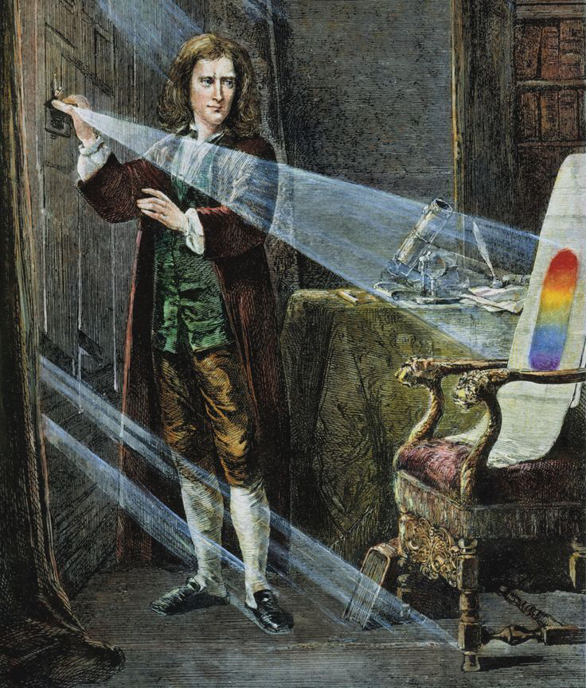
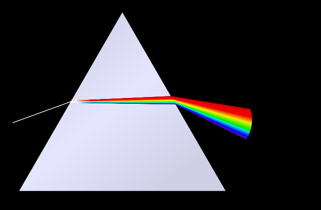
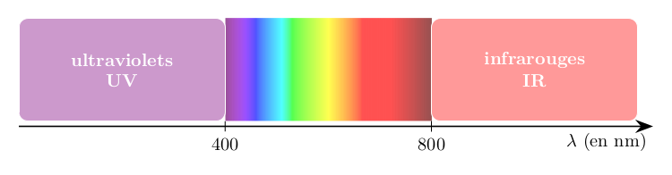
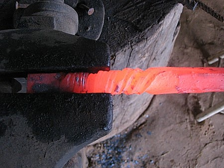
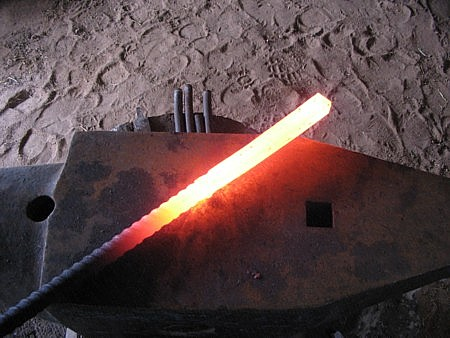
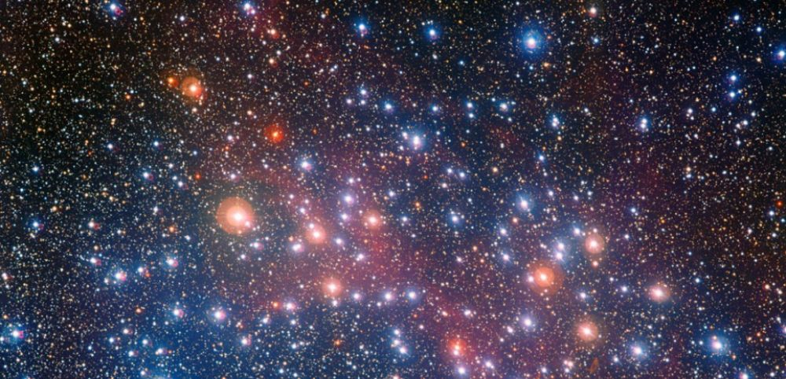

<!-- .slide: data-background-image="./assets/newton.png" data-background-opacity=".7" data-background-size="contain" -->
# Les spectres de lumière

## Newton et le spectre de la lumière blanche

* Le britannique Newton était un fin observateur de la Nature.<!-- .element: class="fragment" data-fragment-index="1" -->
* Il avait observé la nuit des irisations colorées autour de la Lune, mais pensait qu'il s'agissait d'un effet lié à la fatigue de ses yeux (il faisait des observations toute la nuit avec son télescope).<!-- .element: class="fragment" data-fragment-index="2" -->
* Il avait le pressentiment qu'en réunissant les couleurs de l'arc-en-ciel on pouvait retrouver la lumière blanche.<!-- .element: class="fragment" data-fragment-index="3" -->
* En 1663, il achète un prisme et s'amuse à constater qu'il décompose la lumière comme un arc-en-ciel.<!-- .element: class="fragment" data-fragment-index="4" -->

### 1666 : Newton découvre le spectre de la lumère blanche

## Définition

> La *lumière blanche* est polychromatique ; elle est constituée d’une infinité de radiations colorées allant du violet au rouge. On la décompose avec un élément dispersif.

## Longueur d'onde

> La longueur d’onde $\lambda$ est une grandeur qui caractérise chaque radiation colorée. Elle s’exprime normalement en mètres, mais on utilise souvent le nanomètre.
> Le spectre de la lumière blanche s’étend du violet à 400 nm au rouge à 800 nm.

### Conversions

| Le symbole... | ...se lit... | ...et veut dire |
| :---: | :---: | :---: |
| $n$ | nano | $\times 10^{-9}$ |
| $\mu$ | micro | $\times 10^{-6}$ |

*Exemples :*

$$650\,nm=650\times 10^{-9}\,m$$

$$650\,nm= 650\,\times 10^{-3}\times 10^{-6}\,m $$

$$650\,nm= 650 \times 10^{-3}\,\mu m$$

### Exemple

Le Soleil émet un spectre continu de lumière blanche. Mais sa lumière nous paraît jaune. C'est parce qu'il n'émet pas toutes les radiations de la même façon ; il émet principalement aux alentours de $500\,nm$.

### Monochromatique ou polychromatique ?

* Une lumière monochromatique contient une seule radiation lumineuse colorée, et donc une seule longueur d'onde.<!-- .element: class="fragment" data-fragment-index="1" -->
* Une lumière polychromatique contient plusieurs radiations lumineuses colorées.<!-- .element: class="fragment" data-fragment-index="2" -->

# &Eacute;mssion de lumière par un corps chaud

Un corps chauffé émet de la lumière. La couleur de la lumière dépend de la température du corps.

> Plus il est chauffé, plus la lumière émise par le corps s'enrichit de longueurs d'onde vers le violet ; la lumière émise devient blanche.

## Spectres des corps chauffés

> Le spectre d'un corps chauffé est continu. Il s'enrichit de lumières vers le bleu à mesure qu'il devient plus chaud.

### Application aux étoiles

* Une étoile est un corps chaud.<!-- .element: class="fragment" data-fragment-index="1" -->
* Certaines étoiles sont rouges, d'autres jaunes et d'autres bleues.<!-- .element: class="fragment" data-fragment-index="2" -->
* Une étoile qui apparaît rouge n'est pas très chaude.<!-- .element: class="fragment" data-fragment-index="3" -->
* Une étoile qui apparaît jaune est moyennement chaude.<!-- .element: class="fragment" data-fragment-index="4" -->
* Une étoile bleue est très chaude. Son spectre contient toutes les radiations colorées, mais celles de couleur bleue sont tellement intenses que la lumière perçue est bleue.<!-- .element: class="fragment" data-fragment-index="5" -->

## Spectres des vapeurs atomiques

* Une vapeur atomique est un gaz composé d'atomes.<!-- .element: class="fragment" data-fragment-index="1" -->
* Dans certaines conditions, cette vapeur est capable d'émettre de la lumière.<!-- .element: class="fragment" data-fragment-index="2" -->
* La couleur de la lumière émise dépend du gaz.<!-- .element: class="fragment" data-fragment-index="3" -->
* La lumière émise ne contient que quelques longueurs d'onde.<!-- .element: class="fragment" data-fragment-index="4" -->

> Une vapeur atomique émet un spectre discret contenant des lumières de longueurs d'onde préçises.

### Exemples de spectres émis par des lampes à vapeurs atomiques

| Vapeur de mercure $Hg$ | Vapeur de sodium $Na$ |
| :---: | :---: |
|  |  |
|  lumière d'apparence bleutée | lumière d'apparence jaune |

> Un *spectre d'émission* est un spectre discret comportant quelques longueurs d'onde sur fond noir.

Cliquer [ici](https://physique.ostralo.net/spectre_em_abs/) pour vous rendre sur une animation en ligne.

### Les ampoules fluocompactes

* Une ampoule fluocompacte contient un mélange de vapeurs atomiques.
* La lumière émise contient surtout du rouge, du vert et du bleu, et l'œil perçoit du blanc.
* Le spectre contient beaucoup de radiations violettes, ce qui donne une sensation de blanc froid.

