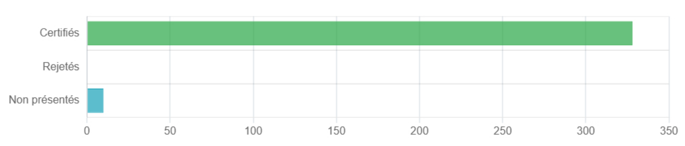
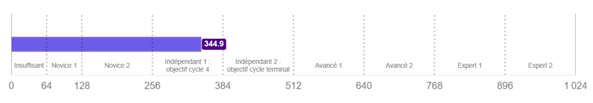
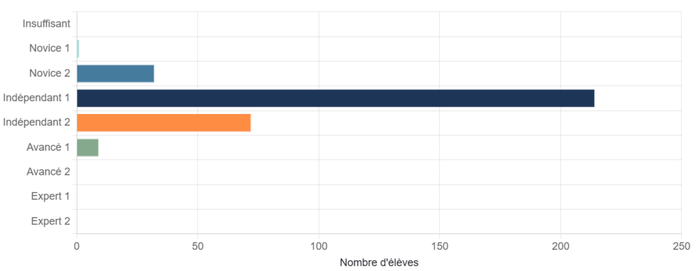

# PIX 

## 01/07/2026

#### Analyse statistique des niveaux : Tle, BTS, CPGE

## Ce que révèlent les résultats 😕

### Taux de certification très élevé

97 % des élèves validés !

*Mais combien de rappels envoyés aux élèves ? Combien d'identifiants perdus ? (...)*

### Mais un niveau global faible

« Indépendant 1 » (attendu en 3ème) *Vs* « Indépendant 2 » (visé pour les Terminales)

## Et une répartition contrastée

### Moyennes par domaine contrastées
    
- Points forts = aisance à manipuler les outils et à dépanner les situations courantes (points 4.0 et 4.1).<!-- .element: class="fragment" -->
- Point faible : création de contenu, protection &amp; sécurité (niveau « Novice 2 / Indépendant 1 ») <!-- .element: class="fragment" -->
- Point très faible : protection de la santé, du bien-être et de l'environnement = niveau le plus faible <!-- .element: class="fragment" -->

### Pour conclure 🫣

En Terminale :
* ⚠️ remontée systématique dans Parcoursup ;
* 36 % des élèves en deçà du niveau attendu ;
* seulement 24 % dépassent les exigences ;
* majorité (41 %) très « proche » des attendus.

> Nécessité d'un renforcement ciblé avant la certification finale.

<a href="./assets/reunionPIX/rapport_PIX_2026.pdf" class="button">Rapport détaillé</a>

## Leviers 💪

Point d'appui pour progresser :
- **Résoudre des problèmes techniques** et **utiliser un environnement numérique** : levier d'entraînement pour les autres compétences.
- **Bonne dynamique collaborative**. Les élèves savent travailler en groupe et partager leurs productions : levier exploitable pour des projets interdisciplinaires.

## Priorités de travail

|  Priorité | Pourquoi ?  |
| --- | --- |
|  1. Recherche d'information & traitement de données (Domaines 1.1-1.3) | Maîtrise de ces compétences indispensable pour les travaux de recherche en BTS/CPGE et pour la rédaction du Grand Oral en Terminale.  |

|  |   |
| --- | --- |
|  2. Création de contenus multimédias & programmation (Domaines 3.1-3.4) | Produire des livrables numériques de qualité est un critère de plus en plus attendu dans les évaluations terminales et les projets professionnels.  |

|  |   |
| --- | --- |
|  3. Protection, santé & bien-être numérique (Domaines 4.1-4.3) | La méconnaissance des risques liés à l'usage intensif du numérique s'oppose aux enjeux de prévention et à la citoyenneté numérique.  |

## Idées pour la mise en œuvre 🤔

* Campagne Pix ciblée « Compétences faibles », autour des compétences 1, 3 et 4.
* Chaque enseignant intègre si possible une activité d'entraînement dans ses cours (ex. : **recherche documentaire** en Hist-Géo, **traitement de données** en SNT, **création de vidéos** en LV).

### Projets (inter)disciplinaires 

Associer des professeurs à la réalisation d'un dossier où les élèves collectent, nettoient et visualisent des données (LibreOffice Calc) puis les présentent sous forme de rapport multimédia (LibreOffice Impress, Canva).

> ➡️ travail simultané de **recherche d'information**, **traitement de données** et **création de contenus**.

### Séquences d'Éducation aux médias et à l'information (EMI)

Réaliser une veille informationnelle (recherche avancée, évaluation de sources) autour de la protection de la santé numérique (sensibilisation aux risques de fatigue visuelle, ergonomie). Utiliser les outils numériques pour produire des posters pratiques à afficher dans l'établissement.

> ➡️ travail simultané de **recherche d'information** et **création de contenus**.

### Accompagner au plus près

😨 Utiliser le tableau de bord Pix Orga pour identifier les élèves en dessous du niveau attendu (Novice 2, Indépendant 1).

🤔 *Et si les enseignants essayaient eux-mêmes Pix ?*

### Des parcours et encore des parcours !

* 2 séances par an, en AP, pour tous les élèves de 2nde, 1ère et Terminale ;
    * un parcours de rentrée avec le PP ;
    * un parcours sur les compétences faibles ;
    * 2nde uniqement : un parcours IA, obligatoire, en classe, plutôt avec prof SNT. Au moins deux séances.
    

