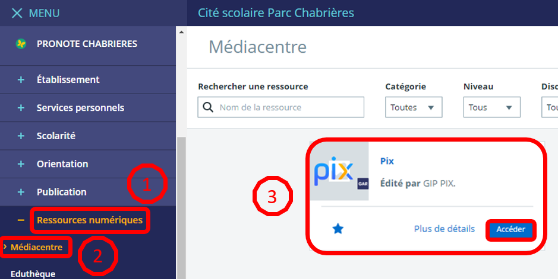
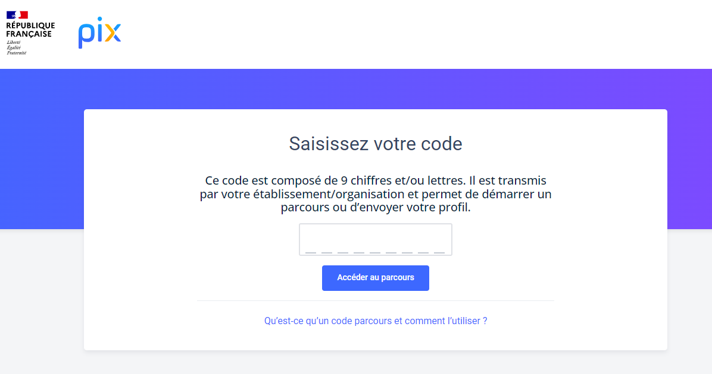
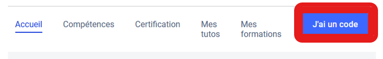
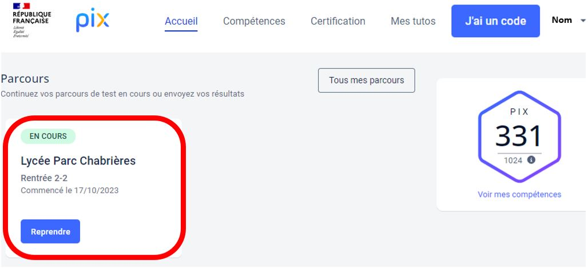
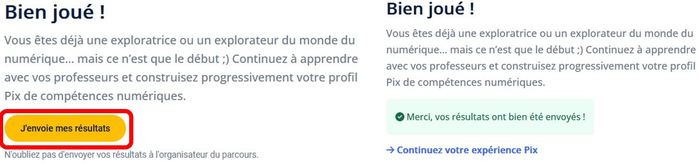
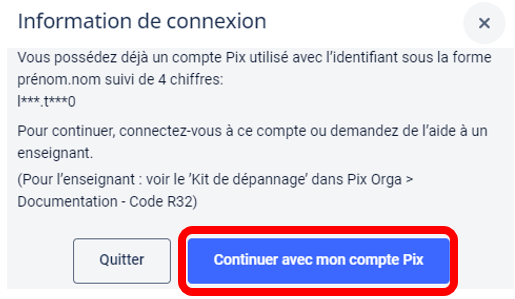
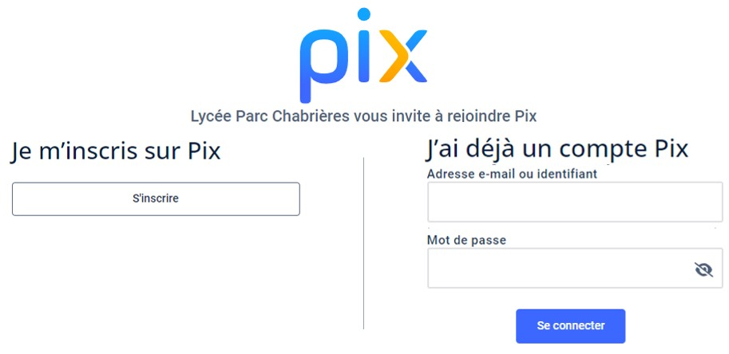

# PIX 

## Tutoriel Élèves

#### Compétences numériques &amp; parcours de rentrée

## Certification obligatoire 🎯

### Pourquoi PIX ?

Pour valoriser leurs compétences numériques, tous les élèves doivent passer une **certification de compétences numériques obligatoire : PIX** en classe de **Terminale** et en **2e année de classe supérieure** (BTS/CPGE).

*Cette certification est un atout indispensable pour votre poursuite d'études et votre insertion professionnelle.*

### Le parcours de rentrée ⏰

Au début de chaque année (2nde, 1ère, Terminale et BTS), chaque élève doit réaliser un **parcours de rentrée obligatoire**, parcours qu'il faut impérativement terminer.

Ce parcours est initié par un **code reçu sur la messagerie** de l'ENT.

> ⚠️ **Important :** Le parcours de rentrée est impératif pour vérifier que vous êtes bien rattaché à l'établissement sur la plateforme PIX. Il est obligatoire de le réaliser, même si vous avez déjà validé des compétences les années précédentes.

## I - Le parcours de rentrée 📝

### Étape A : Connexion via l'ENT

Pour accéder à PIX et réaliser le parcours de rentrée, connectez-vous à l'**ENT** avec votre compte, puis rendez-vous dans :
**Ressources numériques** ➡️ **Médiacentre** ➡️ **PIX**.

> ⚠️ **Attention :**
> * Il faut obligatoirement passer par l'ENT pour se connecter à PIX.
> * Il ne faut pas se créer de compte en dehors de l'ENT.
> * Il ne faut pas se connecter directement à la plateforme PIX.FR.

### Étape B : Saisie du code parcours

Dans la page qui s'ouvre, saisissez le code reçu sur la messagerie de l'ENT, puis cliquez sur **Accéder au parcours**. Confirmez votre date de naissance si nécessaire et commencez le parcours.

### En cas de champ de saisie manquant

Si le message **"Saisissez votre code"** n'apparaît pas, cliquez sur le bouton **"J'ai un code"** situé en haut à droite.

### Sauvegarde et reprise

Vous pouvez interrompre votre parcours à tout moment : vos réponses sont **sauvegardées automatiquement**.

Pour reprendre, reconnectez-vous à l'ENT, repérez le parcours **EN COURS** et cliquez sur **Reprendre**.

> ⚠️ **Attention :** Il est impératif de finir le parcours de rentrée. Une fois terminé, celui-ci n'apparaît plus sur votre tableau de bord.

### Étape C : Transmission des résultats

À la fin du parcours, vous devez obligatoirement transmettre vos résultats pour valider votre participation en cliquant sur **J'envoie mes résultats**.

### Comment fonctionne PIX ? 💡

- **Autonomie** : PIX est une plateforme sur laquelle vous évoluez en toute autonomie.
- **Adaptabilité** : La plateforme est adaptative et vous propose des questions sur-mesure en fonction de votre niveau.
- **Progression** : Une fois le parcours de rentrée terminé, vous pouvez continuer à développer votre profil en cliquant sur chaque compétence pour répondre aux questions.

## II - En cas de problème 🛠️

### Compte existant à l'extérieur

Si le message ci-dessous s'affiche à l'écran, cliquez sur **Continuer avec mon compte Pix** :

### Récupération ou assistance

Dans la fenêtre qui s'ouvre :
- **Si vous vous souvenez de vos accès** (identifiant/mail et mot de passe précédents), utilisez-les pour vous connecter.
	-*Aide-mémoire :* L'identifiant est souvent au format `prénom.nomJJMM` (ex. : `Katherine.Coleman2608` pour Katherine Coleman née le 26 août).
- **Sinon**, informez-en le plus rapidement possible votre **professeur principal** qui pourra soit vous dépanner directement, soit en informer le référent numérique.

## III - Présentation officielle de PIX 🎥

### Découvrez PIX en vidéo

Visionnez cette vidéo de présentation officielle pour tout comprendre sur la plateforme :

## IV - La certification expliquée 🎓

### Vidéo pour les élèves et parents

Comprendre en détail le fonctionnement et les enjeux de la certification finale :

## Crédits &amp; Licence 💳

### Mentions et droits

Ce tutoriel a été adapté pour la présentation à partir du support original : [Pix - parcours de rentrée](https://codimd.apps.education.fr/s/A4nWBBEL3).
